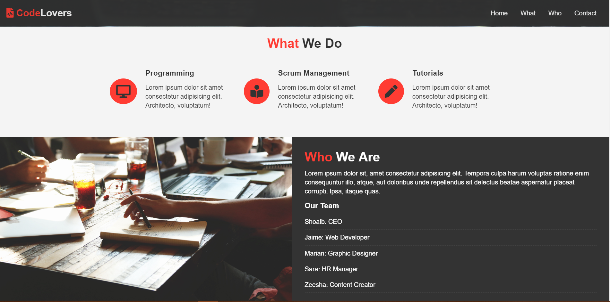

This webiste is developed with HTML5 & CSS3. I also used a little bit of Javascript to implement Google map api and Jquery for smooth scrolling. Only Flexbox has been used for the layout of the website. The purpose of this project was to learn about flexbox and how to layout the website using flexbox system. Website is responsive.

To run the project, Download or clone it on your machine and open it on your browser.

